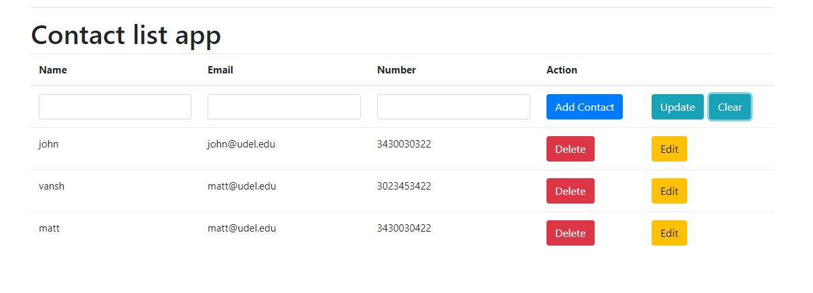

# Contact-List-App

##MEAN Stack RESTful API
###This repo contains the code for a RESTful API Contact List App that was built using the MEAN stack:

*MongoDB
*NodeJS
*Express
*AngularJS

Install Mongodb and run it using command prompt by going to the /bin and running: 
mongod 
After mongodb is running, open another cmd window and use the following commands to create and db, 
MongoDB Enterprise > show dbs  
admin  0.000GB 
local  0.000GB 
MongoDB Enterprise > use contactlist 
switched to db contactlist 
MongoDB Enterprise > db.contactlist.insert({name:"Tom",email:"tom@testemail.com", number:"(444) 444-4444"}) 
WriteResult({ "nInserted" : 1 }) 
MongoDB Enterprise > db.contactlist.find() 
{ "_id" : ObjectId("599de11b47aded362050760e"), "name" : "Tom", "email" : "tom@testemail.com", "number" : "(444) 444-4444" } 
MongoDB Enterprise > db.contactlist.find().pretty() 
{ 
        "_id" : ObjectId("599de11b47aded362050760e"), 
        "name" : "Tom", 
        "email" : "tom@testemail.com", 
        "number" : "(444) 444-4444" 
} 
MongoDB Enterprise > db.contactlist.insert([{name:"Tracy", email:"tracy@testemail2.com", number:"(555) 555-5555"}, {name:"Tucker",  email:"tucker@testemail3.com", number: "(434) 433-5555"}]) 
BulkWriteResult({ 
        "writeErrors" : [ ], 
        "writeConcernErrors" : [ ], 
        "nInserted" : 2, 
        "nUpserted" : 0, 
        "nMatched" : 0, 
        "nModified" : 0, 
        "nRemoved" : 0, 
        "upserted" : [ ] 
}) 
MongoDB Enterprise > db.contactlist.find().pretty() 
{ 
        "_id" : ObjectId("599de11b47aded362050760e"), 
        "name" : "Tom", 
        "email" : "tom@testemail.com", 
        "number" : "(444) 444-4444" 
} 
{ 
        "_id" : ObjectId("599de1f147aded362050760f"), 
        "name" : "Tracy", 
        "email" : "tracy@testemail2.com", 
        "number" : "(555) 555-5555" 
}
{
        "_id" : ObjectId("599de1f147aded3620507610"), 
        "name" : "Tucker", 
        "email" : "tucker@testemail3.com", 
        "number" : "(434) 433-5555" 
} 
MongoDB Enterprise > 

##Install the Node modules with

npm install

npm install express

npm install body-parser

## To run the application, open terminal
node server.js

